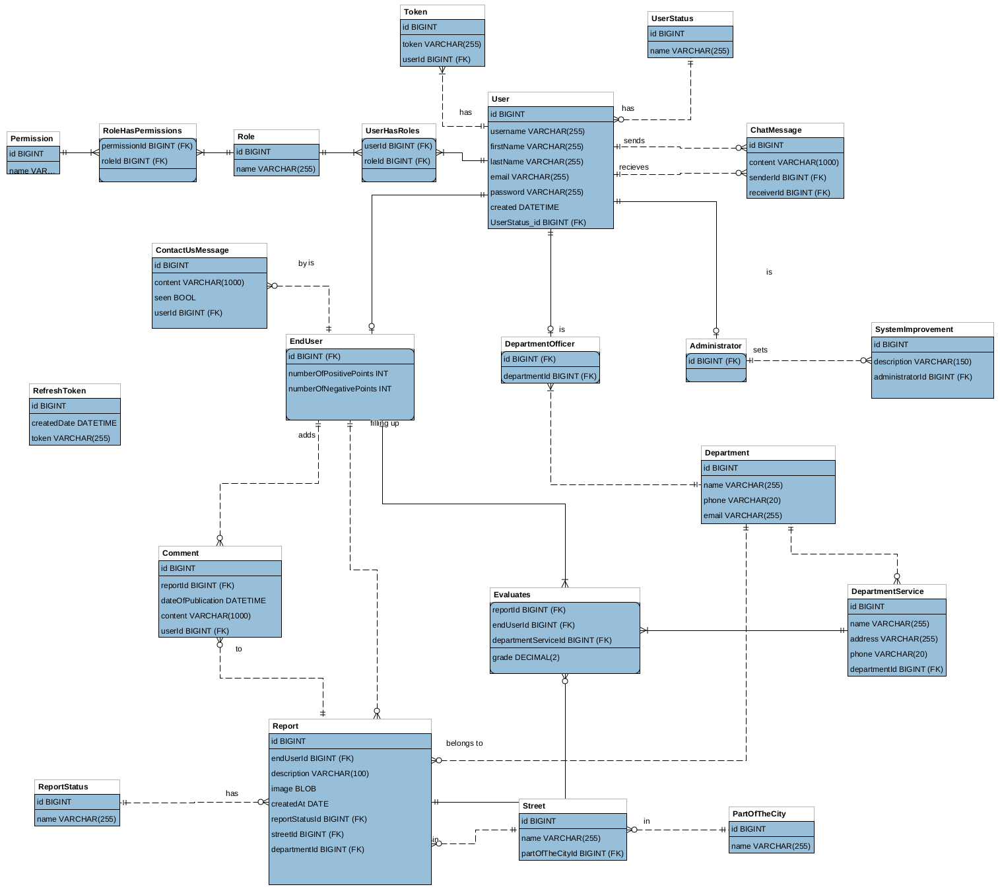

# CleanBL

CleanBL is a platform for managing local issues; from reporting to administration and analysis. It is built using Spring Boot, Spring Security with JPA Authentication, Spring Data JPA with MySQL. The frontend is built using Angular - Frontend source code can be found [here](https://github.com/Corke123/clean-bl-frontend)

## Table of Contents
<details open="open">
   <ul>
      <li>
         <a href="#technology-stack---other-open-source-libraries">Technology stack &amp; other Open-source libraries</a>
         <ul>
            <li><a href="#data">Data</a></li>
            <li><a href="#client---frontend-ui">Client - Frontend/UI</a></li>
            <li><a href="#server---backend">Server - Backend</a></li>
            <li><a href="#libraries-and-plugins">Libraries and Plugins</a></li>
         </ul>
      </li>
      <li>
         <a href="#getting-started">Getting Started</a>
         <ul>
            <li><a href="#prerequisites">Prerequisites</a></li>
            <li><a href="#eer-diagram">EER Diagram</a></li>
         </ul>
      </li>
      <li>
         <a href="#installing">Installing</a>
         <ul>
            <li><a href="#running-the-application-with-ide">Running the application with IDE</a></li>
            <li><a href="#running-the-application-with-maven">Running the application with Maven</a></li>
         </ul>
      </li>
      <li><a href="#documentation">Documentation</a></li>
   </ul>
</details>

## Technology stack & other Open-source libraries

### Data

* 	[Flyway](https://flywaydb.org/) - Version control for database
* 	[MySQL](https://www.mysql.com/) - Open-Source Relational Database Management System
* 	[H2 Database Engine](https://www.h2database.com/html/main.html) - Java SQL database. Embedded and server modes; in-memory databases

### Client - Frontend/UI
* 	[Angular](https://angular.io/) - Application design framework and development platform for creating efficient and sophisticated single-page apps. Source code can be found [here](https://github.com/Corke123/clean-bl-frontend)

### Server - Backend

* 	[JDK](http://www.oracle.com/technetwork/java/javase/downloads/jdk8-downloads-2133151.html) - Java™ Platform, Standard Edition Development Kit
* 	[Spring Boot](https://spring.io/projects/spring-boot) - Framework to ease the bootstrapping and development of new Spring Applications
* 	[Maven](https://maven.apache.org/) - Dependency Management
* 	[JSON Web Token](https://jwt.io/) - Encode or Decode JWTs

###  Libraries and Plugins

* 	[Lombok](https://projectlombok.org/) - Never write another getter or equals method again, with one annotation your class has a fully featured builder, Automate your logging variables, and much more.
* 	[Swagger](https://swagger.io/) - Open-Source software framework backed by a large ecosystem of tools that helps developers design, build, document, and consume RESTful Web services.
*	[auth0](https://github.com/auth0/java-jwt) - A Java implementation of  [JSON Web Token (JWT) - RFC 7519](https://tools.ietf.org/html/rfc7519).

## Getting Started

These instructions will get you a copy of the project up and running on your local machine for development and testing purposes.

### Prerequisites

*	To activate the accounts of registered users, an email with activation link is sent to the email provided during the user signup stage. An **SMTP** is required for the same.

[Mailtrap](https://mailtrap.io/) or any other service like **Gmail**, etc., can be used to create an SMTP.

Configure `src/main/resource/application.properties` according your choice. Example of **Gmail** configuration is below.

```properties
spring.mail.host=smtp.gmail.com
spring.mail.port=587
spring.mail.username=replace_this_with_your_email
spring.mail.password=replace_this_with_your_password
spring.mail.properties.mail.smtp.auth=true
spring.mail.properties.mail.smtp.starttls.enable=true
```
*	You need to have **MySQL** installed on your machine. Using the `MySQL Workbench` or on any other MySQL client/console, create a database/schema named `clean_bl`.
~~~sql
-- create schema
CREATE SCHEMA IF NOT EXISTS `clean_bl` DEFAULT CHARACTER SET utf8 COLLATE utf8_unicode_ci ;

-- use schema
USE `clean_bl` ;

-- Create user 
create user 'cleanbluser'@'localhost' identified by 'Th3_P4ssword';

-- Grant privileges to user
grant all privileges on clean_bl.* to 'cleanbluser'@'localhost' ;
~~~

After creating the database/schema, you need to add your **MySQL** `username` and `password` in the `application.properties` file on `src/main/resource`. The lines that must be modified as follows:

```properties
spring.datasource.url=jdbc:mysql://localhost:3306/clean_bl?characterEncoding=UTF-8
spring.datasource.username=cleanbluser
spring.datasource.password=Th3_P4ssword
```
*	A Java Keystore File is required to generate JSON Web Token.
```shell
keytool -genkey -alias cleanbl_server -keyalg RSA -keysize 2048 -sigalg SHA256withRSA -storetype PKCS12 -keystore keystore.pfx -storepass Th3_P4ssword -dname "CN=CleanBL ON=SI O=ETF L=Banjaluka ST=RS C=BA" -validity 7200
```
Make sure that you put generated keystore in `src/main/resource/` directory, and update `application.properties` file if you use different name and password for `keystore.pfx`

```properties
app.security.jwt.keystore-location=/keystore.pfx
app.security.jwt.keystore-password=Th3_P4ssword
app.security.jwt.key-alias=cleanbl_server
app.security.jwt.private-key-passphrase=Th3_P4ssword
```

*	All uploaded images are stored on local filesystem. To configure desired path for storing images you need to edit `application.properties`

```properties
file.upload-dir=add_your_desired_path_here
```


### EER Diagram

[](images/CleanBL-EER-diagram.png)

## Installing

*	When the application is running, **Flyway** will create the necessary tables and system data along with sample data. When running tests, the application uses **H2** database (data in memory).

* 	URL to access application API is: **http://localhost:8080/**

#### Running the application with IDE

There are several ways to run a Spring Boot application on your local machine. One way is to execute the `main` method in the `org.unibl.etf.ps.cleanbl.CleanBlApplication` class from your IDE.

* 	Download the zip or clone the Git repository.
* 	Unzip the zip file (if you downloaded one)
* 	Open Command Prompt and Change directory (cd) to folder containing pom.xml
* 	Open Eclipse
     * File -> Import -> Existing Maven Project -> Navigate to the folder where you unzipped the zip
     * Select the project
* 	Choose the Spring Boot Application file (search for @SpringBootApplication)
* 	Right Click on the file and Run as Java Application

#### Running the application with Maven

Alternatively you can use the [Spring Boot Maven plugin](https://docs.spring.io/spring-boot/docs/current/reference/html/build-tool-plugins-maven-plugin.html) like so:

```shell
$ git clone https://github.com/Corke123/CleanBL.git
$ cd Spring-Boot-Application-Template
$ mvn spring-boot:run
```

## Documentation

* 	[Swagger](http://localhost:8080/swagger-ui/index.html) - `http://localhost:8080/swagger-ui/index.html`- Documentation & Testing
